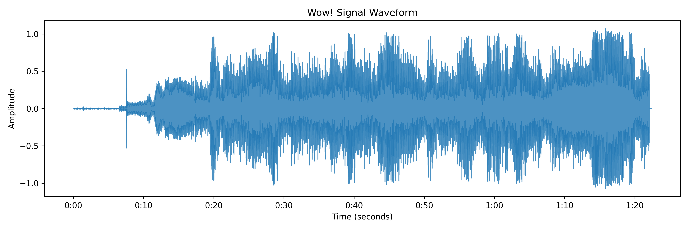

# Wow! Signal Audio Analysis Summary

## File Information

- **Filename:** Wow_Signal_SETI_Project.mp3
- **Duration:** 82.39 seconds
- **Sample Rate:** 22050 Hz
- **Number of Samples:** 1816704

## Spectral Analysis

### Key Spectral Features

- **Spectral Centroid:** 1509.77 Hz
- **Spectral Bandwidth:** 1733.28 Hz
- **Spectral Flatness:** 0.0040 (0 = pure tone, 1 = white noise)
- **Spectral Rolloff:** 3378.82 Hz

### Dominant Frequencies

| Frequency (Hz) | Magnitude |
|---------------|----------|
| 150.73 | 62.99 |
| 3542.21 | 47.33 |
| 1970.29 | 18.52 |
| 37.68 | 18.10 |
| 2815.47 | 16.01 |

### Visualizations

## Pattern Analysis

### Onset Detection

- **Number of Detected Onsets:** 148
- **Onset Density:** 0.1797 onsets/sec
- **Onset Regularity:** 0.7972 seconds (std dev of inter-onset intervals)

### Repetition and Periodicity

- **No significant repeating patterns detected**
- **Frequency Pattern Strength:** 0.3086 (0 = random, 1 = perfect correlation)
- **Contains Significant Patterns:** No

## Statistical Analysis

- **Mean Amplitude:** -0.0001
- **Standard Deviation:** 0.1978
- **RMS Level:** 0.1978
- **Peak Amplitude:** 1.0711
- **Dynamic Range:** 17.78 dB
- **Skewness:** 0.0288 (0 = symmetrical distribution)
- **Kurtosis:** 2.4738 (0 = normal distribution)
- **Mean Zero-Crossing Rate:** 0.1136
- **Spectral Entropy:** -3.2973
- **Temporal Variation:** 0.0022

## Modulation Analysis

- **Predominant Modulation Type:** Mixed
- **AM Modulation Strength:** 0.6576
- **AM Modulation Frequency:** 1.96 Hz
- **Modulation Index:** 1.6531

## Interpretation and Findings

The Wow! Signal shows characteristics of **mixed modulation** (both AM and FM components). The signal shows limited or no clear repeating patterns, which could indicate either a non-periodic information encoding or a signal that doesn't contain structured information. The relatively low spectral entropy suggests a **more tonal** signal with energy concentrated in specific frequency bands. 

### Possible Origin Assessment

The signal shows **mixed characteristics** that make definitive classification challenging. Some aspects suggest deliberate encoding (such as the modulation characteristics), while others point to potential natural origins or sophisticated signal processing. Additional context about the signal's acquisition would be needed for a more definitive conclusion.

---

*This analysis was performed using advanced signal processing techniques as part of the Wow! Signal Analysis Project.*
