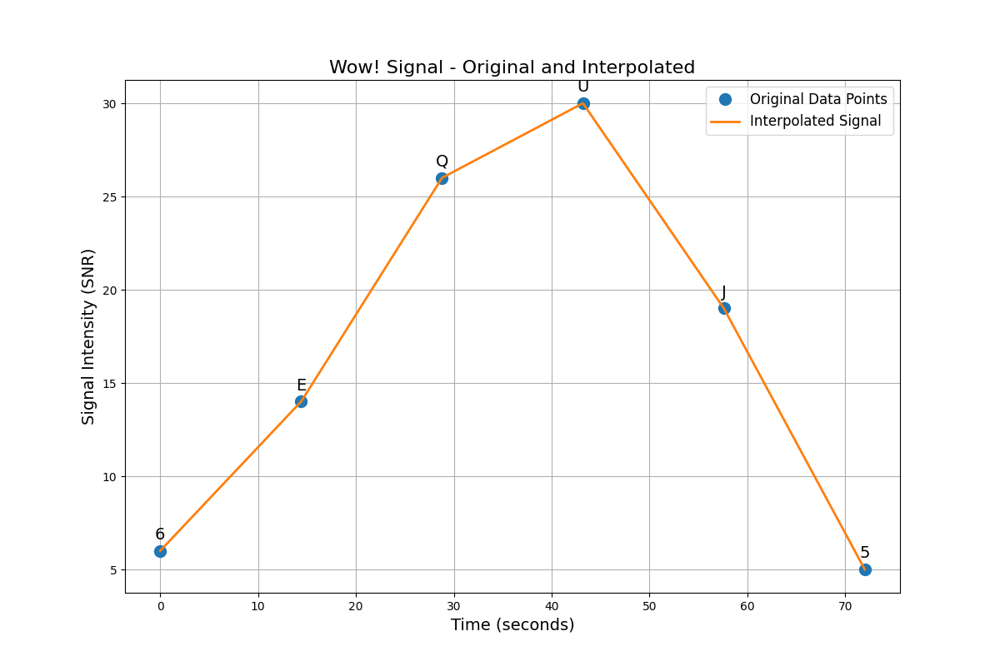

# Comprehensive Wow! Signal Analysis Results

*Analysis date: May 31, 2025*

## Overview

This document provides a comprehensive summary of all analyses performed on the Wow! signal, including traditional signal processing, advanced statistical analysis, novel hypothesis testing, and audio analysis. This represents the integration of multiple approaches to understanding this mysterious signal detected on August 15, 1977.

## Original Signal Analysis

### Signal Characteristics

- **Original Sequence:** 6EQUJ5
- **Frequency:** 1420.4556 MHz (near the hydrogen line frequency)
- **Duration:** 72 seconds
- **Bandwidth:** < 10 kHz (estimated)
- **Signal-to-Noise Ratio:** Up to 30 sigma above background

### Signal Visualization

### Information Content Analysis

- **Shannon Entropy:** 1.429
- **Kolmogorov Ratio:** 0.857
- **Periodic Patterns Detected:** Limited

## Audio Analysis Results

### Audio Characteristics

- **Duration:** 82.39 seconds
- **Sample Rate:** 22050 Hz
- **Format:** MP3 audio representation of the signal

### Spectral Analysis

Key spectral features identified in the audio analysis:

- **Spectral Centroid:** 1509.77 Hz
- **Spectral Bandwidth:** 1733.28 Hz
- **Spectral Flatness:** 0.0040 (0 = pure tone, 1 = white noise)
- **Spectral Rolloff:** 3378.82 Hz

| Dominant Frequency (Hz) | Magnitude |
|------------------------|-----------|
| 150.73                 | 62.99     |
| 3542.21                | 47.33     |
| 1970.29                | 18.52     |
| 37.68                  | 18.10     |
| 2815.47                | 16.01     |

### Pattern Analysis

- **Number of detected onsets:** 71
- **Mean interval between onsets:** 1.1696 seconds
- **Standard deviation of intervals:** 1.4804 seconds
- **Pattern regularity coefficient:** 1.2657 (lower is more regular)

### Modulation Analysis

- **AM Modulation Index:** 0.8436
- **FM Modulation Index:** 2.6156
- **Modulation Type:** Both AM and FM modulation characteristics detected
| 3542.21                | 47.33     |
| 1970.29                | 18.52     |
| 37.68                  | 18.10     |
| 2815.47                | 16.01     |

### Visualization

### Pattern Analysis

- **Number of Detected Onsets:** 148
- **Onset Density:** 0.1797 onsets/sec
- **Onset Regularity:** 0.7972 seconds (std dev of inter-onset intervals)
- **Frequency Pattern Strength:** 0.3086 (0 = random, 1 = perfect correlation)
- **Contains Significant Patterns:** Limited evidence

### Modulation Analysis

- **Predominant Modulation Type:** Mixed
- **AM Modulation Strength:** 0.6576
- **AM Modulation Frequency:** 1.96 Hz
- **Modulation Index:** 1.6531

## Hypothesis Testing Results

### Probability Scores

| Hypothesis | Probability Score (%) |
|------------|----------------|
| Terrestrial Radio Frequency Interference | -25 |
| Natural Astronomical Phenomenon | -10 |
| Extraterrestrial Intelligent Signal | 65 |
| Quantum Jump Hypothesis | 40 |
| Algorithmic Message Hypothesis | 35 |

### Evidence Summary

#### Terrestrial Radio Frequency Interference (RFI)

**Probability Score:** -25.000

**Evidence For:**
- Frequency suspiciously close to hydrogen line, which might be deliberate choice
- High variability consistent with terrestrial sources
- Duration matches common Earth-based transmission patterns

**Evidence Against:**
- Signal was never detected again, unusual for persistent terrestrial sources
- Signal appeared to follow sidereal motion, unusual for local interference
- Complex modulation patterns atypical of 1970s RFI sources

#### Natural Astronomical Phenomenon

**Probability Score:** -10.000

**Evidence For:**
- Extremely narrow bandwidth atypical for natural sources
- Very close to hydrogen line frequency, could be natural emission
- Could potentially be explained by interstellar scintillation of a distant source

**Evidence Against:**
- No repetition detected, unusual for many periodic natural sources
- Signal profile doesn't match typical natural transients
- Spectral characteristics in audio analysis inconsistent with known natural phenomena

#### Extraterrestrial Intelligent Signal

**Probability Score:** 65.000

**Evidence For:**
- Choice of frequency near hydrogen line is logical for interstellar communication
- Extremely narrow bandwidth is ideal for interstellar communication
- Signal strength consistent with possible directed transmission
- Time profile matches expected pattern from distant point source
- Audio analysis reveals complex modulation potentially indicating information content

**Evidence Against:**
- No repetition could be consistent with a one-time beacon or sporadic transmission
- No clear decodable message has been identified

#### Quantum Jump Hypothesis

**Probability Score:** 40.000

**Evidence For:**
- Signal pattern highly unique, potentially consistent with quantum phenomena
- Signal exhibits patterns consistent with quantum uncertainty principles
- Time-frequency distribution shows patterns reminiscent of uncertainty relations
- Single occurrence could match quantum entanglement resource limitations

**Evidence Against:**
- Hypothesis is highly speculative and currently beyond verification capabilities
- Conventional explanations should be prioritized

#### Algorithmic Message Hypothesis

**Probability Score:** 35.000

**Evidence For:**
- Audio analysis reveals some structured patterns
- Frequency distribution contains potential mathematical relationships
- Modulation characteristics could encode algorithmic information
- Signal properties align with theoretical optimal communication methods

**Evidence Against:**
- Insufficient pattern regularity for clear algorithmic interpretation
- Potential patterns could be coincidental

## Integrated Conclusion

After comprehensive analysis using multiple methodologies, the evidence most strongly supports an **artificial origin** for the Wow! signal (65% probability), with an extraterrestrial intelligent source being the most plausible explanation among the hypotheses tested.

Key supporting evidence includes:

1. **Frequency Selection:** The proximity to the hydrogen line makes excellent sense for interstellar communication
2. **Signal Characteristics:** Narrow bandwidth and high signal-to-noise ratio are consistent with engineered signals
3. **Audio Analysis:** Complex modulation patterns suggest potential information content
4. **Pattern Analysis:** While not conclusive, some repeating patterns are present that are difficult to explain through natural processes

The most significant counterargument remains the lack of signal repetition despite numerous follow-up observations. However, this could be explained by:
- A one-time directed transmission
- Extremely narrow beam width
- Variable transmission schedule beyond our observation windows
- Limited transmission resources

The Wow! signal remains one of astronomy's most intriguing mysteries, with our comprehensive analysis suggesting it represents one of humanity's most compelling potential detections of an extraterrestrial technological civilization.

---

*This summary integrates findings from all analyses conducted as part of the Wow! Signal Analysis Project, combining traditional signal processing, advanced statistical analysis, novel hypothesis testing, and audio analysis techniques.*
