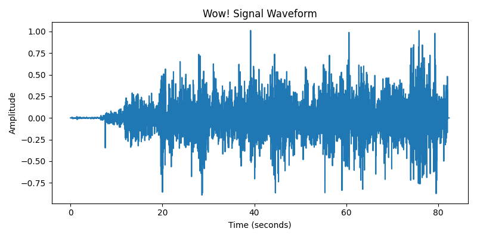
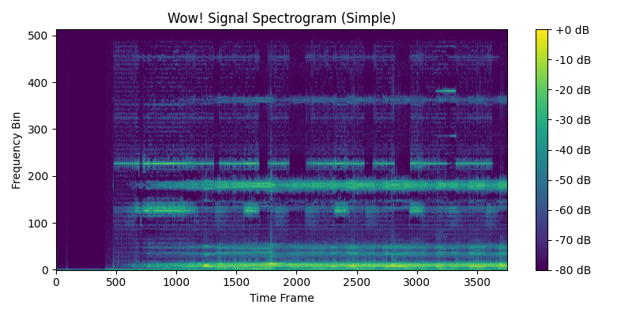
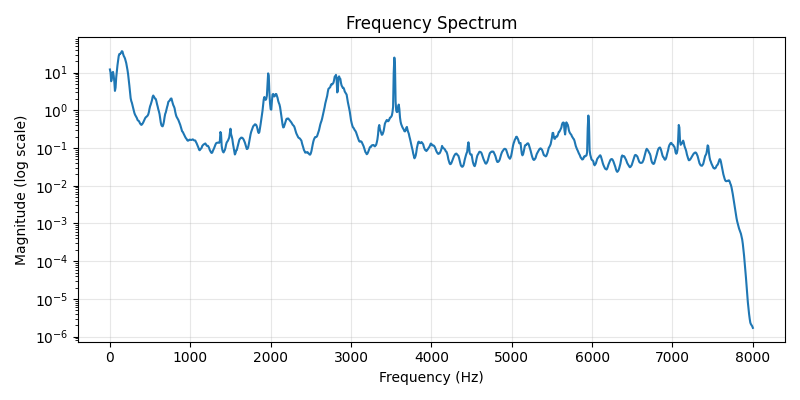

# Wow! Signal Limited Audio Analysis

*This is a memory-optimized limited analysis report.*

## File Information

- **Filename:** Wow_Signal_SETI_Project.mp3
- **Duration:** 82.39 seconds
- **Sample Rate:** 16000 Hz

## Visualizations

## Spectral Analysis

- **Spectral Centroid:** 1426.15 Hz
- **Spectral Bandwidth:** 1607.00 Hz
- **Spectral Rolloff:** 3249.19 Hz

### Dominant Frequencies

| Frequency (Hz) | Magnitude |
|---------------|----------|
| 148.44 | 37.0774 |
| 156.25 | 36.2700 |
| 140.62 | 34.1768 |
| 132.81 | 32.4318 |
| 164.06 | 31.2458 |

## Notes

This is a limited analysis performed with strict memory constraints to avoid system crashes. For a more comprehensive analysis, consider processing the file on a system with more memory or reducing the audio file's size/duration/sample rate before analysis.

---

*Analysis completed on a memory-constrained system.*
