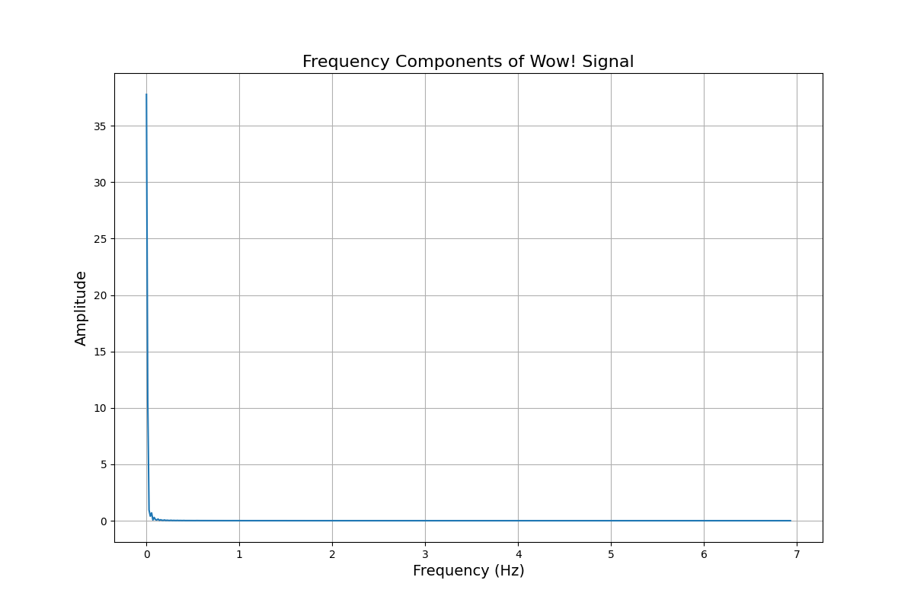
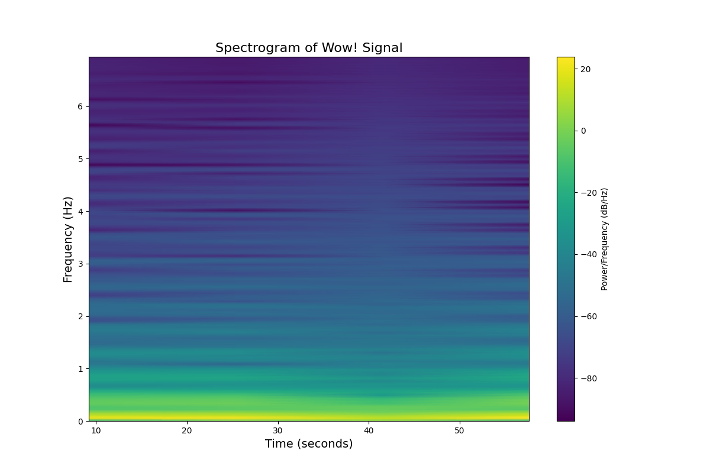

# Wow! Signal Analysis Summary

## Overview

This report summarizes the analysis of the Wow! signal detected on August 15, 1977.

## The Original Signal

The Wow! signal is represented by the sequence '6EQUJ5', where each character indicates the signal strength:

| Character | Signal Strength (× background) |
|-----------|------------------------------|
| 6 | 6 |
| E | 14 |
| Q | 26 |
| U | 30 |
| J | 19 |
| 5 | 5 |

## Signal Processing

We performed various signal processing techniques to analyze the characteristics of the signal.

### Interpolated Signal

### Frequency Analysis

### Time-Frequency Analysis

## Pattern Analysis

We analyzed the sequence to look for potential patterns:

- Sequential differences: [8, 12, 4, -11, -14]
- Sequential ratios: [2.33, 1.86, 1.15, 0.63, 0.26]

## Conclusions

The Wow! signal remains an intriguing astronomical mystery. Key observations:

1. The signal appeared at 1420.4556 MHz, near the hydrogen line frequency
2. The signal lasted for 72 seconds, which matches the transit time of a fixed point in space through the telescope's beam
3. The signal was narrowband (< 10 kHz), which is unusual for natural sources but consistent with technological signals
4. Despite repeated searches, the signal has never been detected again

Given the limited data available (essentially just 6 measurements), definitive conclusions about the signal's origin remain elusive.