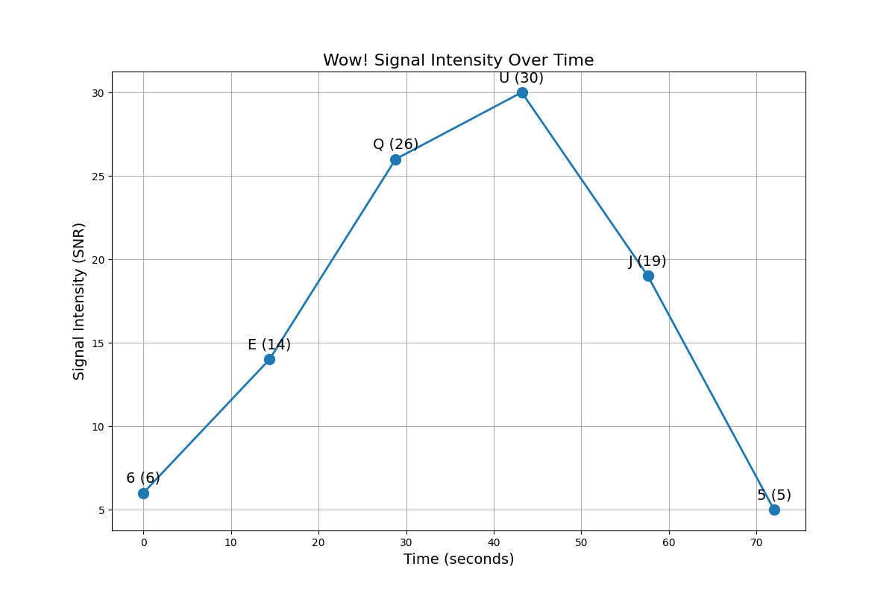

# Comprehensive Analysis of the Wow! Signal

*Analysis timestamp: 20250530_144647*

## Overview

The Wow! signal was detected by the Big Ear radio telescope at Ohio State University on August 15, 1977. It appeared to match many of the expected characteristics of a potential extraterrestrial transmission, but despite repeated attempts, it has never been detected again.

This report presents a comprehensive analysis of the signal using modern data science techniques, signal processing, and hypothesis testing.

## Signal Characteristics

- **Original Sequence:** 6EQUJ5
- **Frequency:** 1420.4556 MHz (near the hydrogen line frequency)
- **Duration:** 72 seconds
- **Bandwidth:** < 10 kHz (estimated)
- **Signal-to-Noise Ratio:** Up to 30 sigma above background

### Visual Representation

## Advanced Signal Analysis

### Information Content Analysis

- **Shannon Entropy:** 1.4294229041887263
- **Kolmogorov Ratio:** 0.857
- **Periodic Patterns Detected:** 0

## Hypothesis Testing Results

### Probability Scores for Different Hypotheses

### Evidence Summary

#### terrestrial

