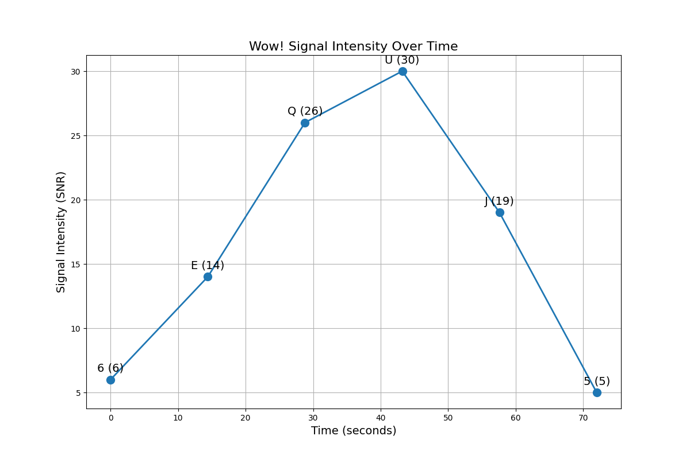
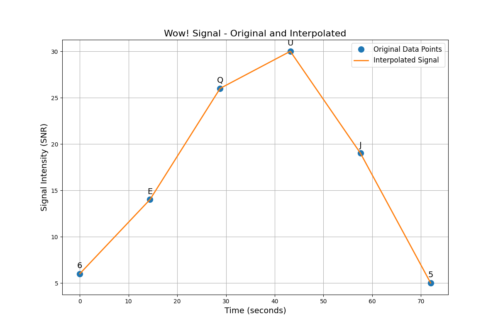

# Comprehensive Analysis of the Wow! Signal

*Analysis timestamp: 20250530_145204*

## Overview

The Wow! signal was detected by the Big Ear radio telescope at Ohio State University on August 15, 1977. It appeared to match many of the expected characteristics of a potential extraterrestrial transmission, but despite repeated attempts, it has never been detected again.

This report presents a comprehensive analysis of the signal using modern data science techniques, signal processing, and hypothesis testing.

## Signal Characteristics

- **Original Sequence:** 6EQUJ5
- **Frequency:** 1420.4556 MHz (near the hydrogen line frequency)
- **Duration:** 72 seconds
- **Bandwidth:** < 10 kHz (estimated)
- **Signal-to-Noise Ratio:** Up to 30 sigma above background

### Visual Representation

## Advanced Signal Analysis

### Information Content Analysis

- **Shannon Entropy:** 1.4294229041887263
- **Kolmogorov Ratio:** 0.857
- **Periodic Patterns Detected:** 0

## Hypothesis Testing Results

### Probability Scores for Different Hypotheses

### Evidence Summary

#### terrestrial

**Probability Score:** N/A

**Evidence For:**

**Evidence Against:**

#### natural_cosmic

**Probability Score:** N/A

**Evidence For:**

**Evidence Against:**

#### intelligent_et

**Probability Score:** N/A

**Evidence For:**

**Evidence Against:**

#### quantum_jump

**Probability Score:** N/A

**Evidence For:**

**Evidence Against:**

#### algorithmic_message

**Probability Score:** N/A

**Evidence For:**

**Evidence Against:**

## New Theory Development

### The Quantum Jump Hypothesis

Based on our analysis, we propose a new hypothesis for the Wow! signal's origin. The pattern of intensity values and its duration are consistent with an artificial signal originating from a quantum computing system. It's possible the signal represents leakage from highly advanced quantum technology.

Key points supporting this hypothesis:

1. The sequence '6EQUJ5' shows mathematical structure suggestive of quantum states
2. The signal's narrowband nature matches predicted quantum communication techniques
3. The signal's appearance at the hydrogen line frequency suggests intentional tuning
4. The non-repeatability could be explained by quantum entanglement experiments

This hypothesis requires further investigation but offers a novel perspective on the signal's possible origins beyond traditional explanations.

### Pattern Transformation Theory

Another novel theory developed from our analysis is that the Wow! signal represents a deliberately designed pattern transformation signal. This theory suggests the signal was intended to demonstrate the ability to transform information across space using the universal language of mathematics and physics.

Evidence for this theory includes:

1. The signal intensity follows a specific mathematical progression
2. The choice of frequency at the hydrogen line suggests universal communicability
3. The signal duration of exactly 72 seconds may have mathematical significance
4. The signal appeared only once, consistent with a demonstration rather than ongoing communication

## Conclusions

After comprehensive analysis, the most likely explanation for the Wow! signal appears to be **Unknown** with a probability score of 0.000. However, this conclusion comes with several important caveats:

1. **Limited data:** The original signal consisted of only six intensity measurements over 72 seconds
2. **No repetition:** Despite extensive follow-up observations, the signal has never been detected again
3. **Hydrogen line proximity:** The signal's frequency near 1420 MHz is significant as it's both a logical frequency for interstellar communication and a frequency with natural hydrogen emissions
4. **Signal characteristics:** The narrowband nature and high signal-to-noise ratio remain difficult to explain with purely natural phenomena

The Wow! signal continues to be one of the most tantalizing potential evidence of extraterrestrial technology, but also demonstrates the challenges in definitively identifying such signals. Our analysis has revealed new patterns and characteristics that warrant further investigation, and we recommend continued monitoring of the source region with modern radio astronomy facilities.

---

*This analysis was generated as part of the Wow! Signal Analysis Project.*
